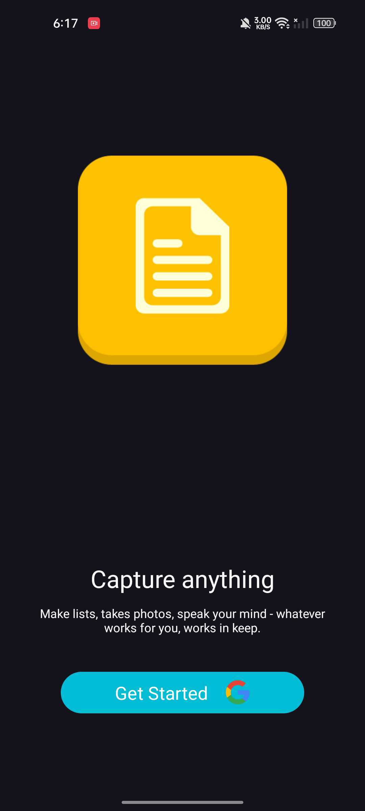
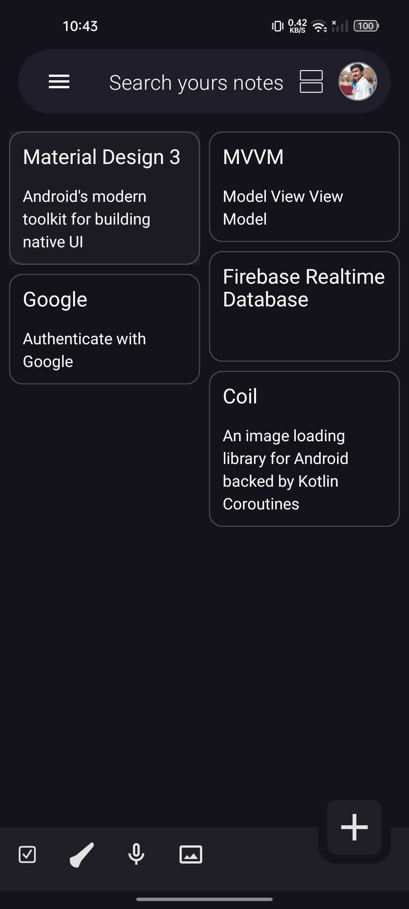
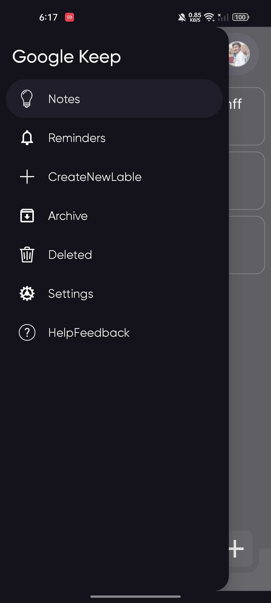
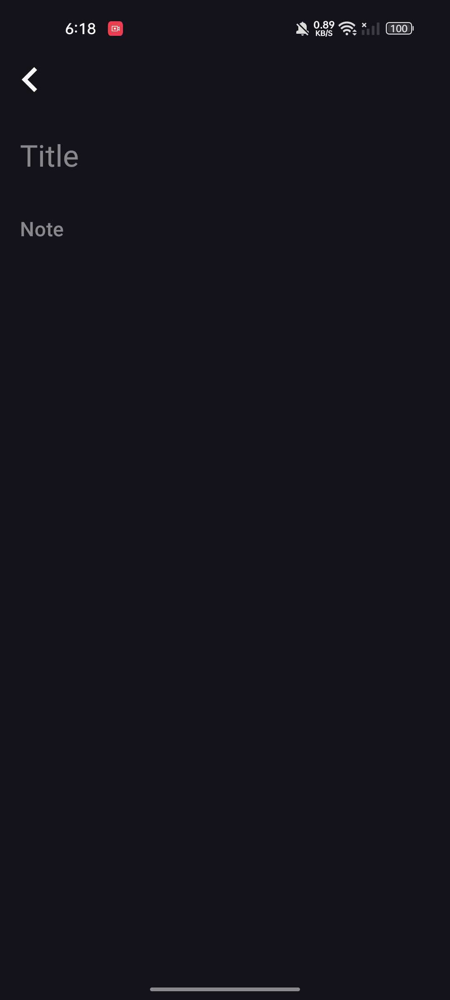

<h1 align="center">
   Keep-notes
</h1>

  
  
  

## Introduction

This project uses [Jetpack Compose](https://developer.android.com/jetpack/compose) technology, in short jetpack Compose is Android’s recommended modern toolkit for building native UI. It simplifies and accelerates UI development on Android. Quickly bring your app to life with less code, powerful tools, and intuitive Kotlin APIs.
To try out this sample app, use the latest stable version of [Android Studio](https://developer.android.com/studio). You can clone this repository or import the project from Android Studio following the steps [here](https://developer.android.com/jetpack/compose/setup#sample).

## Features

This sample contains three screens: a list of notes, a edit or new note, and a google login to change account. The navigation from the list of notes to the interests screen uses a navigation drawer. Delete note and create a copy of note
   
See how to:
- Use `Rows` and `Columns` to arrange the contents of the UI
- Add a top app bar that elevates as the user scrolls
- Use Material's `Typography` and `ColorScheme` to style the text
- Use tonal elevation to make the `Cards` stand out from the background

# Preview App
| Login Screen  | Home Screen | Edit Note Screen |
| ------------- | ------------- | ------------- |
|   |  |  | 

| Navigation Drawer | New Note Screen | Full Video |
| ------------- | ------------- | ------------- | 
|  |   | <video src="https://github.com/roshansharma824/Keep-notes/assets/85518522/36f8fc0c-140a-40a3-aba6-955a9f23ffb0" height=500 width=250/> |

## Tech Stack
- MVVM (Model View View Model)
- Use Case (for interaction data)
- Clean Architecture (data, domain, layer)
- Clean Code
- Firebase Realtime Database
- Authenticate with Google 
- Coil (An image loading library for Android backed by Kotlin Coroutines)
- Material Design 3 (Android's modern toolkit for building native UI)

## Dependencies
- [Compose UI](https://developer.android.com/jetpack/androidx/releases/compose-ui)
- [Dagger-Hilt](https://developer.android.com/training/dependency-injection/hilt-android)
- [Firebase Realtime Database](https://firebase.google.com/docs/database/android/start)
- [Authenticate with Google](https://firebase.google.com/docs/auth/android/google-signin)
- [Accompanist System UI Controller](https://google.github.io/accompanist/systemuicontroller/)
- [Coil](https://coil-kt.github.io/coil/compose/)
- [Material Design 3](https://m3.material.io/develop/android/jetpack-compose)

